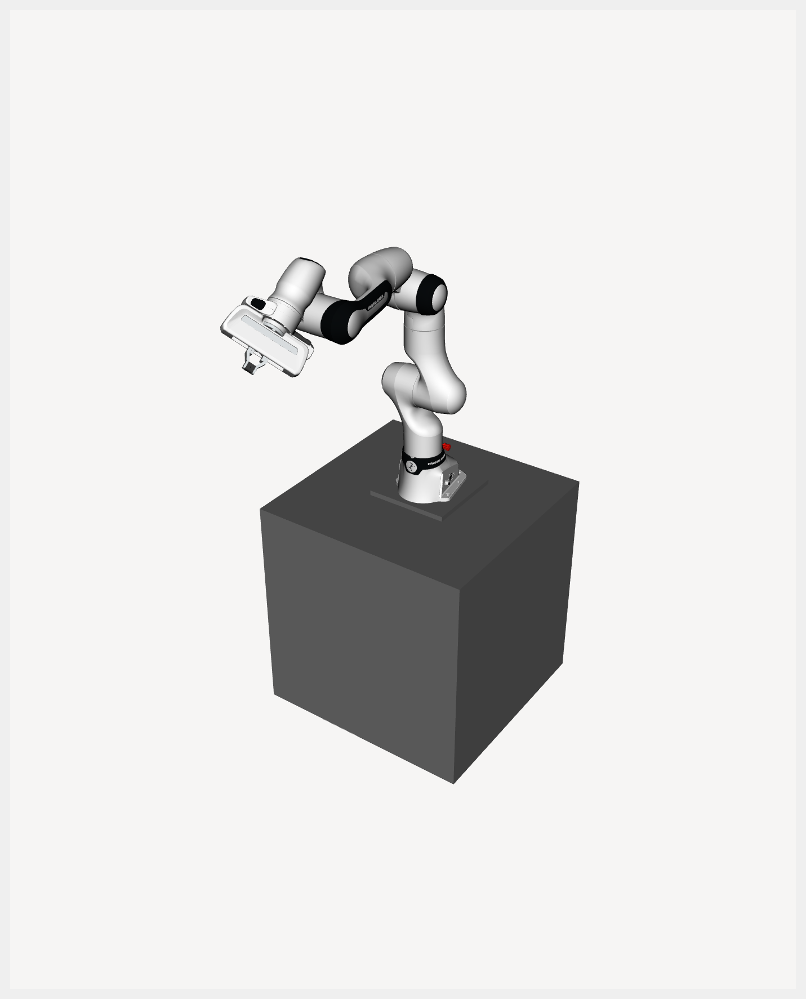
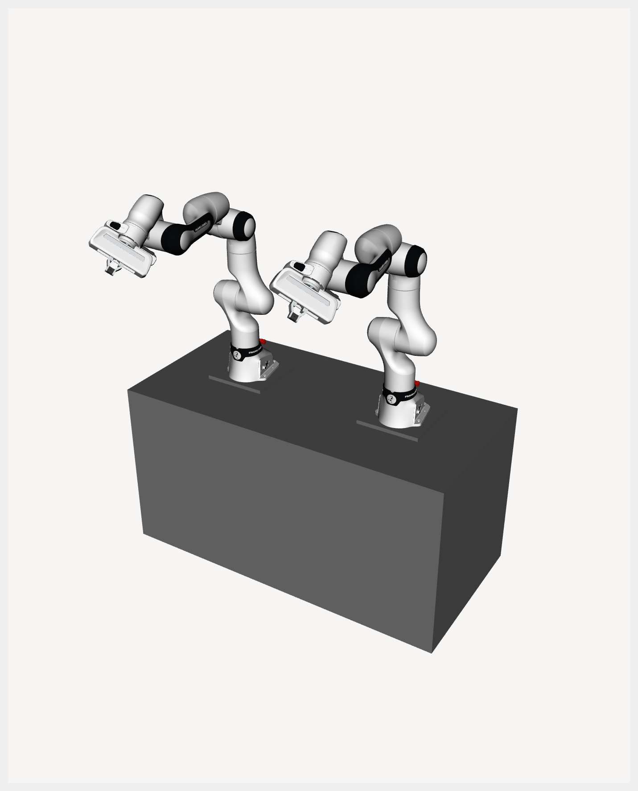
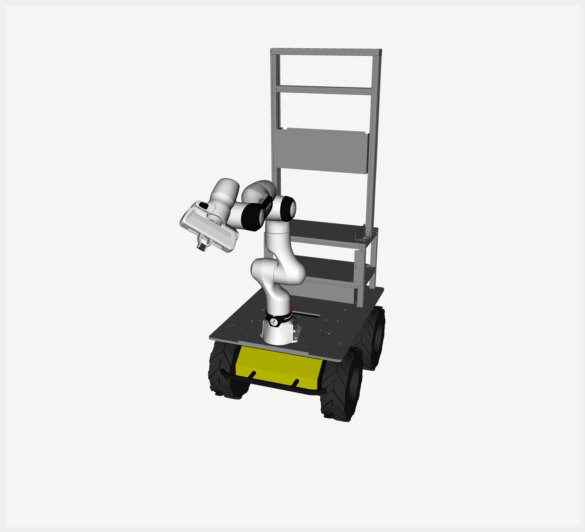
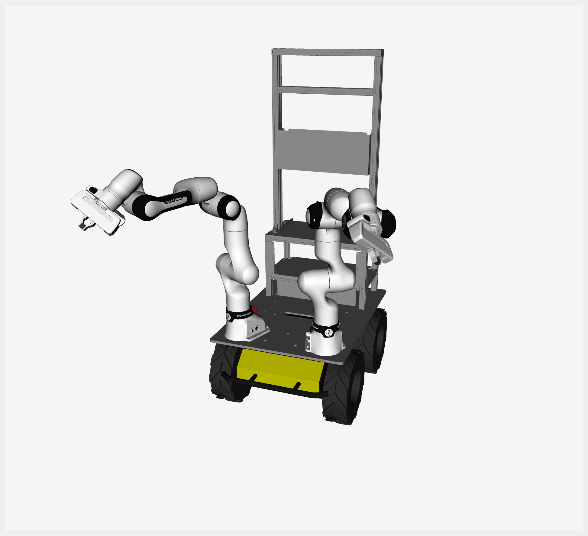

# FR3 Husky ROS 2 Workspace

## Table of Contents
- [Dependencies](#2-dependencies)
- [Installation](#3-installation)
- [Package Descriptions](#4-package-descriptions)
- [Short Description](#41-short-description)
- [Executables and Usage](#42-executables-and-usage)
---
## Dependencies

### Required apt Packages
- [ROS2 Humble](https://docs.ros.org/en/humble/index.html)  
- [libfranka](https://frankarobotics.github.io/docs/libfranka/docs/installation.html) (Install it without franka_ros2 & franka_description!)

### Required Source Dependencies
- [franka_ros2](https://github.com/JunHeonYoon/franka_ros2) - it includes multi_hardware_interface
- [franka_description](https://github.com/JunHeonYoon/franka_description) - it includes multi_hardware_interface URDF
- [husky](https://github.com/JunHeonYoon/husky) - fix for using with franka (1000Hz)
- [dyros_robot_controller](https://github.com/JunHeonYoon/dyros_robot_controller) - for robot_data

---

## Installation

1. Clone this repository into your ROS 2 workspace:
```bash
cd ~/ros2_ws/src
git clone https://github.com/JunHeonYoon/fr3_husky.git
```

2. Install dependencies with `rosdep`:
```bash
cd ~/ros2_ws
rosdep update
rosdep install --from-paths src --ignore-src -r -y
```

3. Build:
```bash
cd ~/ros2_ws
colcon build --symlink-install --packages-up-to \
  fr3_husky_msgs \
  fr3_husky_description \
  fr3_husky_controller \
  fr3_husky_moveit_config
```

4. Source workspace:
```bash
source ~/ros2_ws/install/setup.bash
```
---

## Package Descriptions

## Description

### `fr3_husky_msgs`
- Defines custom action interfaces.
- Example: `GravityCompensation.action`.

### `fr3_husky_description`
- Contains FR3/Husky robot descriptions (`xacro`, mesh, RViz configs).
- Supports single-arm and dual-arm configurations, with or without Husky base.
```bash
# FR3 visualization (optionally with mobile base)
ros2 launch fr3_husky_description visualize_fr3.launch.py \
  robot_side:=left load_gripper:=true load_mobile:=false

# FR3 + Husky visualization
ros2 launch fr3_husky_description visualize_fr3_husky.launch.py \
  robot_side:=left load_gripper:=true
```
- Main launch arguments:
  - `robot_side`: `left`, `right`, `dual`
  - `load_gripper`: `true|false`
  - `load_mobile`: `true|false` (`visualize_fr3.launch.py` only)

| Single FR3                     | Dual FR3                      |
| ------------------------------ | ----------------------------- |
|   |     |

| Single FR3 Husky               | Dual FR3 Husky                |
| ------------------------------ | ----------------------------- |
|   |     |


### `fr3_husky_controller`
- Provides `ros2_control` controller plugins for:
  - FR3 test controller
  - Husky test controller
  - FR3+Husky test controller
  - FR3 action controller
  - FR3+Husky action controller
- Includes launch files for running controller manager, RViz, gripper launch, and teleop integration.
- Exported controller plugin types:
  - `fr3_husky_controller/TestFR3Controller`
  - `fr3_husky_controller/TestHuskyController`
  - `fr3_husky_controller/TestFR3HuskyController`
  - `fr3_husky_controller/FR3ActionController`
  - `fr3_husky_controller/FR3HuskyActionController`

- Launch files:
```bash
# FR3 test controller (non-action)
ros2 launch fr3_husky_controller fr3_controller.launch.py \
  robot_side:=left load_gripper:=true load_mobile:=false use_fake_hardware:=true

# FR3 action controller
ros2 launch fr3_husky_controller fr3_action_controller.launch.py \
  robot_side:=left load_gripper:=true load_mobile:=false use_fake_hardware:=true

# Husky-only test controller
ros2 launch fr3_husky_controller husky_controller.launch.py

# FR3 + Husky test controller (with teleop pipeline)
ros2 launch fr3_husky_controller fr3_husky_controller.launch.py \
  robot_side:=left load_gripper:=true use_fake_hardware:=true

# FR3 + Husky action controller (includes joy_node)
ros2 launch fr3_husky_controller fr3_husky_action_controller.launch.py \
  robot_side:=left load_gripper:=true use_fake_hardware:=true joy_dev:=/dev/input/js0
```

- Main launch arguments:
  - `robot_side`: `left`, `right`, `dual`
  - `namespace`: ROS namespace
  - `load_gripper`: `true|false`
  - `load_mobile`: `true|false` (FR3-only launch files)
  - `use_fake_hardware`: `true|false`
  - `fake_sensor_commands`: `true|false`
  - `joy_dev`, `joy_deadzone`, `joy_autorepeat_rate` (`fr3_husky_action_controller.launch.py` only)

- Action usage examples (after action controller is running):
```bash
# Discover action endpoints
ros2 action list | grep gravity

# FR3 action controller example
ros2 action send_goal \
  /left_fr3_action_controller/fr3_gravity_compensation \
  fr3_husky_msgs/action/GravityCompensation \
  "{use_qp: true}" \
  --feedback

# FR3+Husky action controller example
ros2 action send_goal \
  /left_fr3_husky_action_controller/fr3_husky_gravity_compensation \
  fr3_husky_msgs/action/GravityCompensation \
  "{use_qp: true}" \
  --feedback
```

- Utility scripts (developer helper, not installed as ROS executables):
```bash
# Generate FR3 action server 
python3 fr3_husky_controller/generate_fr3_action_server.py GravityCompensation

# Generate FR3+Husky action server 
python3 fr3_husky_controller/generate_fr3_husky_action_server.py GravityCompensation
```


### `fr3_husky_moveit_config`
- Provides MoveIt 2 launch/config for FR3 single/dual setups.
- Includes controller mappings, OMPL planning config, and RViz profile.

```bash
# Recommended MoveIt launch for single/dual setup
ros2 launch fr3_husky_moveit_config fr3_moveit.launch.py \
  robot_side:=left load_gripper:=true load_mobile:=false use_fake_hardware:=true
```
- Main launch arguments (`fr3_moveit.launch.py`):
  - `robot_side`: `left`, `right`, `dual`
  - `namespace`
  - `load_gripper` : `true|false`
  - `load_mobile` : `true|false`
  - `use_fake_hardware` : `true|false`
  - `fake_sensor_commands` : `true|false`

---


## Notes
- Default FR3 IPs in launch files are hardcoded:
  - left arm: `172.16.5.5`
  - right arm: `172.16.6.6`
- For real hardware, verify network setup and safety conditions before launching controllers.
